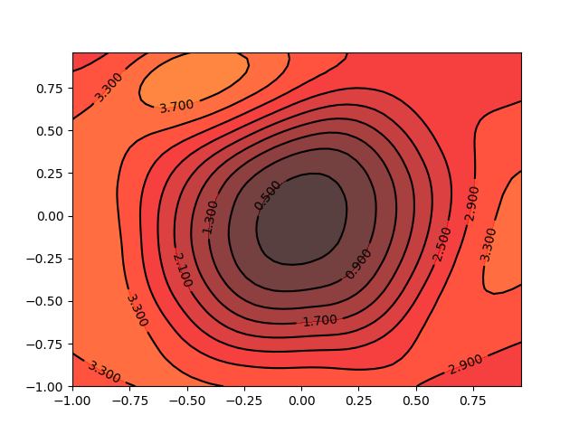

# Influence of Network Depth & Skip Connections on Loss Landscape (CS28010 project)
###Requirements:

- python=3.7.3
- pytorch=1.3.1
- torchvision=0.4.2
- tqdm=4.40.2
- numpy=1.16.4

---
### Dataset

- [cifar10](https://www.cs.toronto.edu/~kriz/cifar.html)

The dataset will be automatically downloaded when running the process.
Or you can put your pre-downloaded data in `args.data_dir` in `main.py`.

---

### Commands

Run scripts in the directory `scripts` for experiments with different settings.

e.g. `bash scripts/vgg11.sh` for the loss surface contour map of VGG-11.

